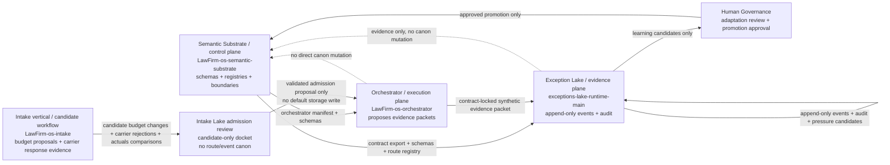
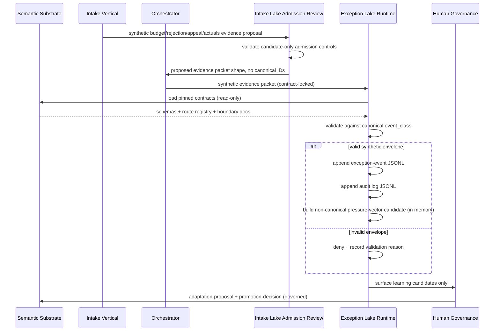

# Data Flow Map

## Summary

Canonical machine name: `exceptions-lake-runtime-main`. Plane: evidence. Sibling repos: `LawFirm-os-semantic-substrate` (control plane, canonical authority) and `LawFirm-os-orchestrator` (execution plane). For full sibling-repo names and authority order across repos, see substrate `governance/CROSS_REPO_MAP.md`.

This repo is the evidence plane. It owns append-only runtime records and synthetic audit evidence. It consumes substrate contracts read-only via a pinned SHA in `contracts.lock.json`. It does not promote or mutate canon.

## Governed learning path (canonical)

```text
exception-event -> pressure-vector -> adaptation-proposal -> promotion-decision
```

This MVP runtime stops at synthetic, non-canonical pressure-vector candidates. Adaptation proposals and promotion decisions are not produced by this runtime.

## Substrate consumption

The substrate publishes the EL-facing contract export at `registry/exceptions-lake-contract-export.json`. The runtime loader prefers this manifest. If absent, it falls back to:

- `registry/schema-registry.json`
- `registry/exceptions-schema-registry.json`
- `registry/governed-learning-schema-registry.json`
- `registry/exception-route-registry.json`

Canonical route authority (read-only):

- `route.retrieval_miss.v1` -> `event_class: retrieval_miss`
- `route.workflow_escalation.v1` -> `event_class: workflow_escalation`
- `route.authority_conflict_override.v1` -> `event_class: authority_conflict_override`

The runtime never invents canonical `route_id` or `event_class` values. See `docs/CANONICAL_ROUTE_MAPPING.md` for the local-label-to-canonical mapping.

## Mermaid flowchart



## Mermaid sequence



## Intake Lake Admission Review (candidate-only)

`registry/intake-lake-admission-review-registry.json` and `docs/INTAKE_LAKE_ADMISSION_REVIEW.md` define the local candidate review docket for future intake-to-Lake evidence. The docket covers:

- budget proposal, human correction, carrier-compliant projection, approved amount if known, actual billed amount, write-down or disallowance, and variance-driver candidates;
- carrier rejection capture from future email or portal sources, with an explicit `unknown_or_new_rejection_pattern` bucket;
- appeal authorization, appeal packet candidate, appeal result, financial outcome, and learning-candidate follow-up.

This docket does not create canonical `route_id` or `event_class` values, does not create SQLite tables or migrations, does not authorize carrier portal/email connectors, does not store raw legal payloads, does not ingest real data, and does not write default runtime records. The only current flow is candidate review metadata plus deterministic validation.

## Pre-PR07 Draft Scaffolds (non-canonical)

These substrate artifacts are explicitly outside Phase 2 canonical authority and the runtime treats them as metadata only:

- substrate `registry/research-radar-source-registry.json` — pre-PR07 draft. Marked `non_authoritative: true` and `phase: "pre-pr07-draft"`. Does not authorize live crawling, scheduled jobs, model calls, external APIs, external writes, or production research automation.
- substrate `schema/` (singular) — legacy Phase 1 doctrinal-comparison substrate. Does not replace canonical `schemas/`.

## Hard prohibitions

- no real client, matter, employee, or policy data
- no production connectors
- no dashboards
- no canon mutation
- no promotion to canon
- no live model calls in the MVP
- no scheduled jobs
- no live Research Radar collection, external APIs, or autonomous research execution
- no invented `route_id` or `event_class`
- no writes into the substrate repo path
- no intake/carrier SQLite migration or default storage write without a separate governed implementation
- no carrier portal/email connector capture without a separate governed implementation

## Pin and refresh

The substrate is pinned by SHA in `contracts.lock.json`. Required fields:

- `contract_repo: LawFirm-os-semantic-substrate`
- `contract_ref_type: git_sha`
- `contract_sha: <substrate commit>`
- `generated_at: <ISO8601>`
- `generated_by: exceptions-lake-runtime-main`

Lock validation is fail-closed on missing fields, invalid fields, or SHA drift.

## Latest data-flow change

- Date: 2026-05-06
- Changed by: Codex
- What changed: Replaced placeholder substrate identity (`your-org/law-firm-ontology`, `law-firm-ontology-contracts`, "Law Firm ontology") with the canonical `LawFirm-os-semantic-substrate` machine name and "Law Firm OS Semantic Substrate" human label across `contracts.lock.json`, CI, lock-refresh script, and runtime docs. The current contract pin is substrate commit `43991155f0286e6d8bc5ba0bfe6b42407b1b3f12`. Created this `DATA_FLOW_MAP.md` for evidence-plane orientation.
- Risk color: yellow. Identity-alignment change with no behavior change.
- Harness level: H1 documentation/identity update plus existing validation.

- Date: 2026-06-30
- Changed by: Codex
- What changed: Added candidate-only intake Lake admission review flow for budget changes, carrier rejections, appeals, actuals comparison, and learning candidates. Added deterministic pytest runtime policy requiring `python scripts/run_full_pytest.py`.
- Risk color: yellow. Governance/data-flow metadata and validation policy with no runtime storage, connector, migration, or canon authority change.
- Harness level: H1 governance metadata plus deterministic validators and pytest policy tests.
